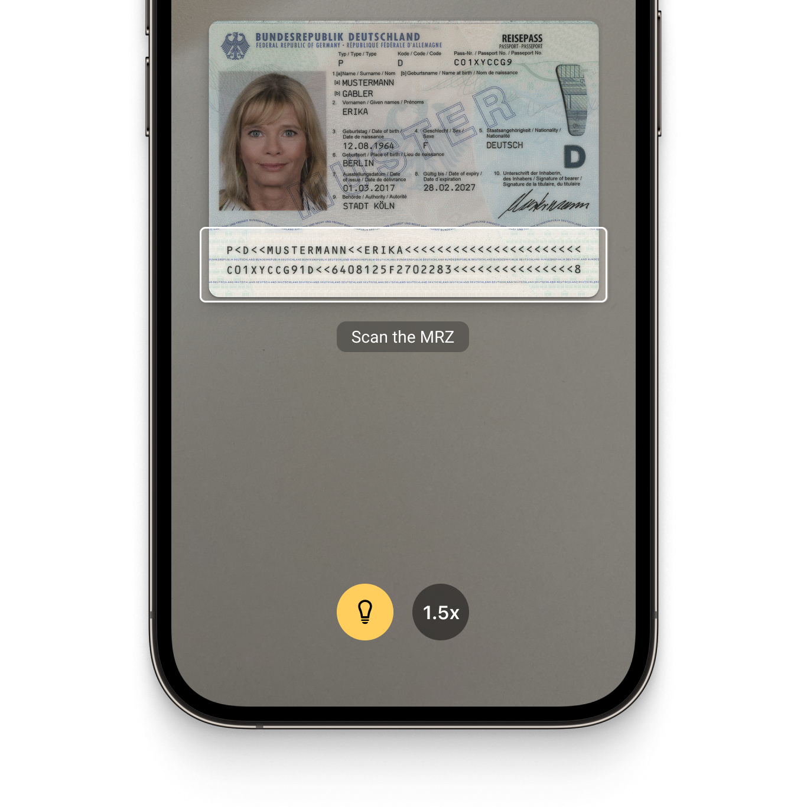

<p align="left">
  
</p>
<p align="left">
  
</p>

# Example app for the Scanbot Flutter Document Scanner SDK and Data Capture Modules

This example app shows how to integrate the [Scanbot Document Scanner SDK](https://scanbot.io/document-scanner-sdk/?utm_source=github.com&utm_medium=referral&utm_campaign=dev_sites) and [Scanbot Data Capture Modules](https://scanbot.io/data-capture-software/?utm_source=github.com&utm_medium=referral&utm_campaign=dev_sites) for Flutter.

## What is the Scanbot SDK?

The Scanbot SDK is a set of high-level APIs that lets you integrate document scanning and data extraction functionalities into your mobile apps and websites. It runs on all common mobile devices and operates entirely offline. No data is transmitted to our or third-party servers.

With our Ready-To-Use UI (RTU UI) components, you can integrate the Scanbot SDK into your Flutter app in less than an hour.

💡 For more details about the Scanbot Flutter Document Scanner SDK and Data Capture Modules, please check out our [documentation.](https://docs.scanbot.io/document-scanner-sdk/flutter/introduction/?utm_source=github.com&utm_medium=referral&utm_campaign=dev_sites)

## How to run this example app?

### Preparations

Install [Flutter](https://flutter.dev/) and all required dev tools for your project setup.

Fetch this repository and navigate to the project directory.

```
cd scanbot-sdk-example-flutter/
```

Fetch and install the dependencies of this example project via Flutter CLI:

```
flutter pub get
```

Connect a mobile device via USB and run the app.

### Run the app

#### Android:

```
flutter run -d <DEVICE_ID>
```

You can get the IDs of all connected devices via `Flutter devices`.

#### iOS:

Install Pods dependencies:

```
chmod +x clean-ios.sh
./clean-ios.sh
```

Open the **workspace**(!) `ios/Runner.xcworkspace` in Xcode and adjust the *Signing / Developer Account* settings. Then build and run the app in Xcode.

**Note**: please make sure that you configured the camera access accordingly.

## Overview of the Scanbot SDK

### Document Scanner SDK

The Scanbot Flutter Document Scanner Plugin offers the following key document scanning features: 

* **User guidance**: Ease of use is critical for large user bases, which is why the SDK provides a consistent user interface that ensures a smooth and intuitive experience for all users. The SDK simplifies document scanning by guiding users through each step, helping even non-tech-savvy users create perfect scans.

* **Automatic capture**: The SDK ensures accurate document detection by automatically capturing the scan when the device is optimally positioned over the document. This significantly reduces the risk of blurry or incomplete scans that can occur with manual capture.

* **Automatic cropping**: Our SDK uses edge detection to identify document borders automatically. Auto-cropping then straightens and crops the scanned images, improving the document scanning result, or the user is prompted to reposition the document for optimal scanning.

* **Custom filters:** Every use case has specific image format requirements. The SDK’s custom filters allow you to transform the scanned document images into optimal input for your backend systems. They include several color, grayscale, and binarization options.

* **Document Quality Analyzer:** This feature automatically rates the quality of the scanned pages from “very poor” to “excellent.” If it is low, it can prompt the user to rescan, ensuring they always achieve the highest-quality document scanning result. 

* **Export formats:** The Scanbot Flutter Document Scanner SDK supports various formats for exporting and processing physical documents into digital files (JPG, PDF, TIFF, and PNG). This ensures your downstream solutions receive the best format to store, print, or share the digitized document – or to process it further.

|  |  |  |
| :-- | :-- | :-- |

### Data Capture Modules

The Scanbot SDK Data Capture Modules allow you to extract data from a wide range of structured documents and to integrate OCR text recognition capabilities. They include:

#### [MRZ Scanner](https://scanbot.io/data-capture-software/mrz-scanner/?utm_source=github.com&utm_medium=referral&utm_campaign=dev_sites) 
This module allows quick and accurate data extraction from the machine-readable zones on identity documents. It captures all important MRZ data from IDs and passports and returns it in the form of simple key-value pairs. This is much simpler, faster, and less mistake-prone than manual data entry.

#### [Check Scanner (MICR)](https://scanbot.io/data-capture-software/check-scanner/?utm_source=github.com&utm_medium=referral&utm_campaign=dev_sites)
The MICR Scanner offers reliable data extraction from international paper checks, capturing check numbers, routing numbers, and account numbers from MICR codes. This simplifies workflows and reduces errors that frustrate customers and employees.

#### [Text Pattern Scanner](https://scanbot.io/data-capture-software/data-scanner/?utm_source=github.com&utm_medium=referral&utm_campaign=dev_sites)
Our Text Pattern Scanner allows quick and accurate extraction of single-line data. It captures information based on customizable patterns tailored to your specific use case. This replaces error-prone manual data entry with automatic capture.

#### [VIN Scanner](https://scanbot.io/data-capture-software/vin-scanner/?utm_source=github.com&utm_medium=referral&utm_campaign=dev_sites)
The VIN scanner enables instant capture of vehicle identification numbers (VINs) from trucks or car doors. It uses OCR to convert the image of the VIN code into structured data for backend processing. This module integrates into mobile or web-based fleet management applications, enabling you to replace error-prone manual entry with fast, reliable data extraction.

#### Document Data Extractor
Through this feature, our SDK offers document detection and data capture capabilities for a wider range of documents. It accurately identifies and crops various standardized document types including [German ID cards](https://scanbot.io/data-capture-software/id-scanner/?utm_source=github.com&utm_medium=referral&utm_campaign=dev_sites), passports, [driver's licenses](https://scanbot.io/data-capture-software/german-drivers-license-scanner/?utm_source=github.com&utm_medium=referral&utm_campaign=dev_sites), [residence permits](https://scanbot.io/data-capture-software/residence-permit-scanner/?utm_source=github.com&utm_medium=referral&utm_campaign=dev_sites), and the [EHIC](https://scanbot.io/data-capture-software/ehic-scanner/?utm_source=github.com&utm_medium=referral&utm_campaign=dev_sites). It uses the Scanbot OCR engine for accurate data field recognition, without requiring additional OCR language files.

|  |  |  |
| :-- | :-- | :-- |

## Additional information

### Free integration support

Need help integrating or testing our Document Scanner SDK? We offer [free developer support](https://docs.scanbot.io/support/?utm_source=github.com&utm_medium=referral&utm_campaign=dev_sites) via Slack, MS Teams, or email.

As a customer, you also get access to a dedicated support Slack or Microsoft Teams channel to talk directly to your Customer Success Manager and our engineers.

### Trial license and pricing 

The Scanbot SDK examples will run for one minute per session without a license. After that, all functionalities and UI components will stop working. 

To try the Scanbot Flutter SDKs without the one-minute limit, you can request a free, no-strings-attached [7-day](https://scanbot.io/trial/?utm_source=github.com&utm_medium=referral&utm_campaign=dev_sites) trial license for your Flutter project.

Alternatively, check out our [demo apps](https://scanbot.io/demo-apps/?utm_source=github.com&utm_medium=referral&utm_campaign=dev_sites) to test the SDK.

Our pricing model is simple: Unlimited document scanning for a flat annual license fee, full support included. There are no tiers, usage charges, or extra fees. [Contact](https://scanbot.io/contact-sales/?utm_source=github.com&utm_medium=referral&utm_campaign=dev_sites) our team to receive your quote.

### Other supported platforms

Besides Flutter, the Scanbot Document Scanner SDK is also available on:

* [Android](https://github.com/doo/scanbot-sdk-example-android) (native)
* [iOS](https://github.com/doo/scanbot-sdk-example-ios) (native)
* [JavaScript](https://github.com/doo/scanbot-sdk-example-web)
* [Capacitor & Ionic (Angular)](https://github.com/doo/scanbot-sdk-example-capacitor-ionic)
* [Capacitor & Ionic (React)](https://github.com/doo/scanbot-sdk-example-ionic-react)
* [Capacitor & Ionic (Vue.js)](https://github.com/doo/scanbot-sdk-example-ionic-vuejs)
* [Cordova & Ionic](https://github.com/doo/scanbot-sdk-example-ionic)
* [.NET MAUI](https://github.com/doo/scanbot-sdk-maui-example)
* [React Native](https://github.com/doo/scanbot-sdk-example-react-native)
* [Xamarin](https://github.com/doo/scanbot-sdk-example-xamarin) & [Xamarin.Forms](https://github.com/doo/scanbot-sdk-example-xamarin-forms)

Our Barcode Scanner SDK additionally also supports [Compose Multiplatform / KMP](https://github.com/doo/scanbot-barcode-scanner-sdk-example-kmp), [UWP](https://github.com/doo/scanbot-barcode-scanner-sdk-example-windows) (Windows), and [Linux](https://github.com/doo/scanbot-sdk-example-linux).
